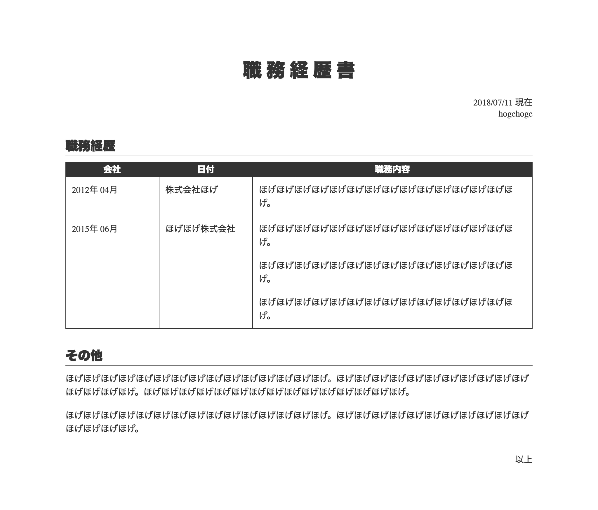
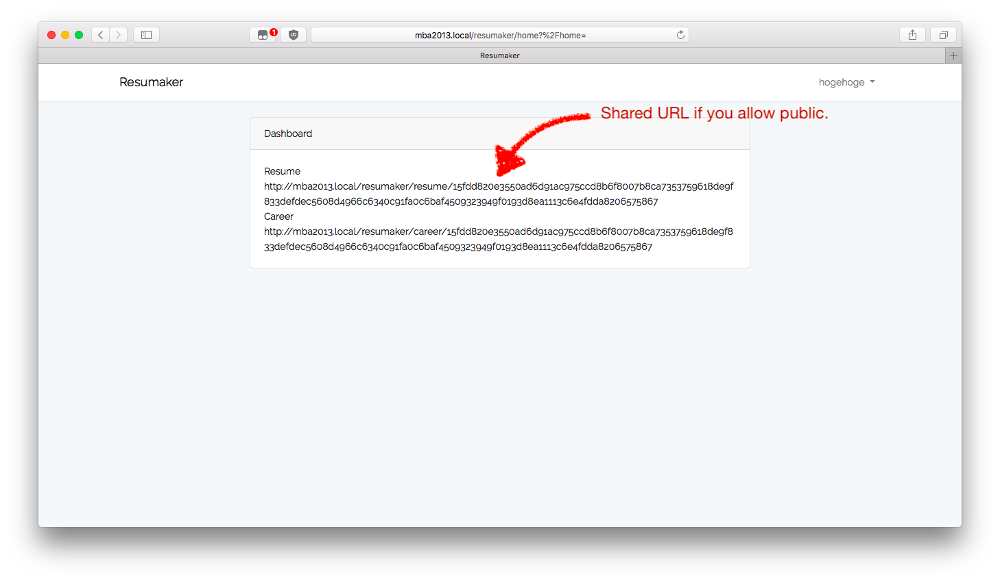

## About Resumaker

This is a Laravel app which makes resume and career sheet as Japanes style. And this can share your resume and career sheet with someone which knows the URL.

- Save your information.
- Fit your face image automatically.
- Make resume and career sheet.
- Share your resumes to someone which knows the URL.

[](resumaker1.png)
[](resumaker2.png)
[](resumaker3.png)
[](resumaker4.png)

## Required

```
Laravel 5.6.x
composer require intervention/image
```

## Todo

- Convert AD to Japanese calendar automatically.
- Improve UI.

## License

MIT

## Reference and Special Thanks
[css履歴書の逆襲](https://qiita.com/liarnose/items/bfcc2c731665464acb2a)
